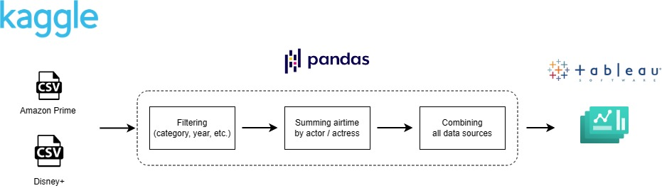
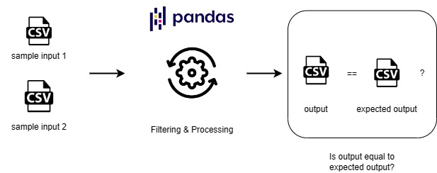

# ViewSonic Data Scientist Interview Case Study Assignment

THis is to utilize a statistical approach to surface insights of actors / actresses that are best suitable to shoot our 2024 summer cruise TV commercial ad. 

## Architecture




## Testing



## Usage

To run the code:
```
python .\code\family_videos_analysis.py  # analyze on all dataset

python .\code\family_videos_analysis.py --movies # analyze only on movies dataset
```

To run the end-to-end test:
```
pytest
```